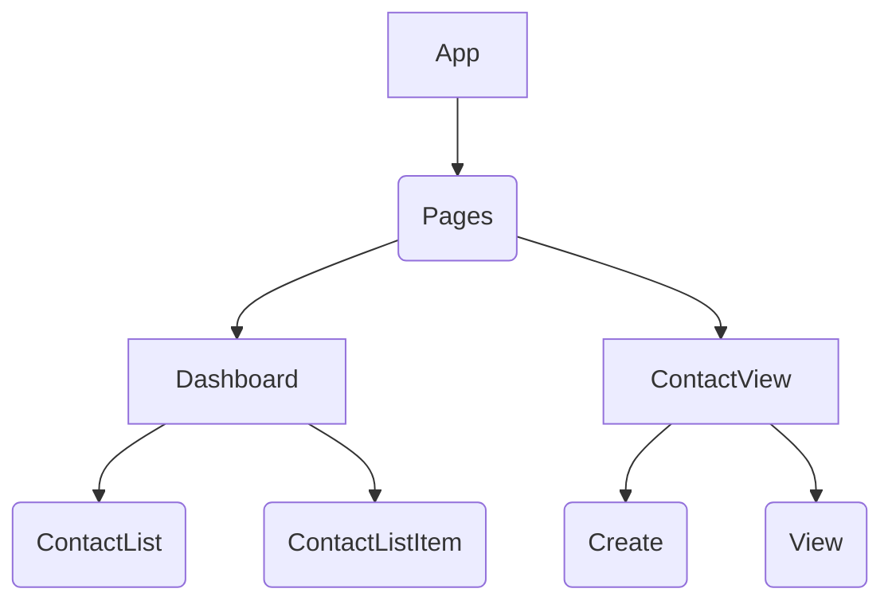

# Checklist

## Part 1
### State Model
```
[
    {
        id: 1,
        firstname: "First Name",
        lastname: "Last Name",
        street: "Street 1",
        city: "City 1"
    }
]
```

### Component tree


## Core

- [x] 1. A user can view a dashboard that displays a list of contacts
    - Each contact in the list should be displayed as their first and last names
- [x] 2. A user can click a contact's name to view more details about that contact
    - The view should contain the contact's first and last name, as well as the contact's street and city
- [ ] 3. A user can create a contact via a form, accessed by clicking a "Create a contact" menu link
    - The form should create a contact with a first and last name, as well as a street and city
    - When submitted, the contact data should be sent to an API that saves it
    - The user should then be automatically navigated back to the contact list

## Extensions
(For full marks complete Extensions 1 and 2 plus two other extension)

- [ ] 1. Allow for deleting a contact

- [ ] 2. Allow for updating a contact's information

- [ ] 3. Automatically navigate to the contact list after deleting a contact

- [ ] 4. Automatically navigate to the single contact information view after updating a contact

- [ ] 5. Implement the remaining contact properties available in the API into your application

- [ ] 6. Use a contact's `latitude` and `longitude` geo-coordinates to render their position on a map

- [ ] 7. Add the ability to filter the contact list